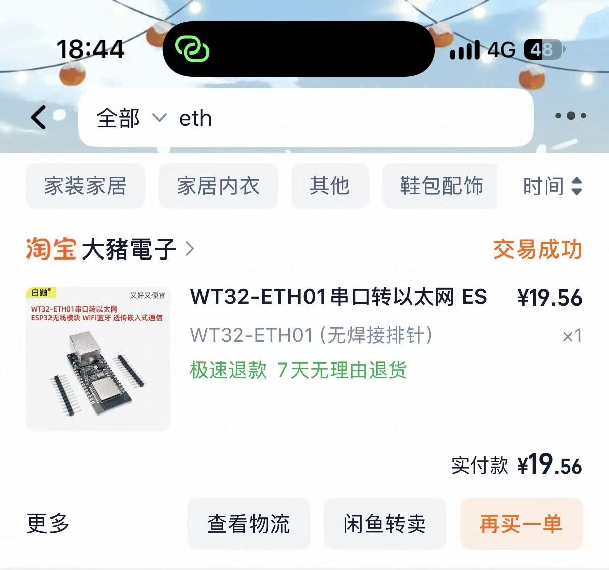
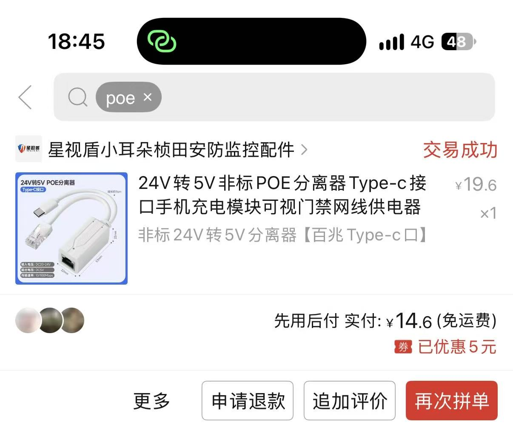
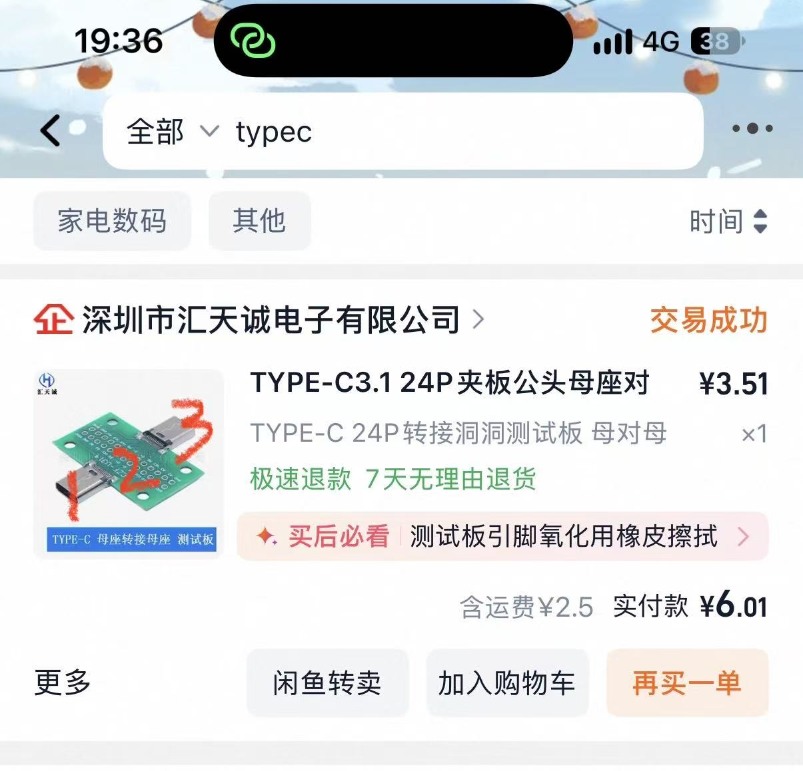
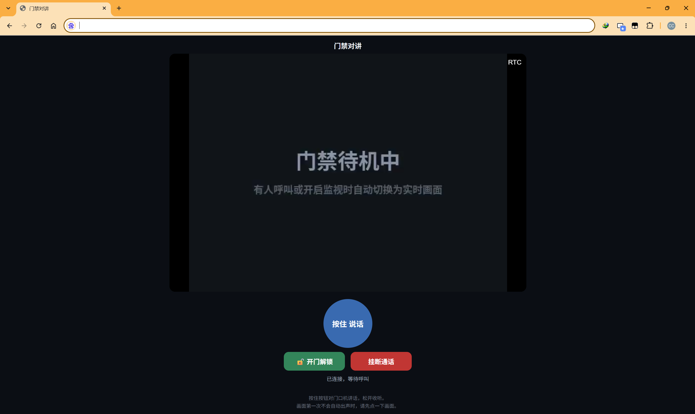
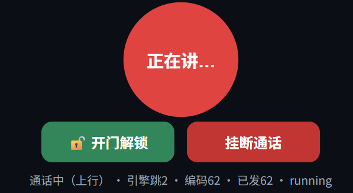

# 安居宝门禁智能化改造：视频 + 双向对讲 + 平板应答

把传统安居宝（Anjubao）可视对讲门禁接入 Home Assistant，实现在手机/平板上：
**看到访客画面、双向语音对讲、一键开门、呼叫时自动跳转响铃**。

本仓库是作者自家（4 台门口机：南门/西门/单元一楼/单元负一楼 1台室内机安居宝AJB-ZD19C-8触摸屏无实体按键）改造的最终开源版，
协议数据全部来自真实抓包。本仓库已脱敏：不含任何真实账号、密码、公网地址。

## 功能一览

- **视频监控**：门口机摄像头画面通过go2rtp推流到 Home Assistant，没有监视画面时显示"门禁待机中"，因为go2rtp推流插件，如果断流后，可能彻底down了，所以空闲时候推送"门禁待机中"字幕流，让流一直保持活跃状态
- **双向语音对讲**：浏览器打开面板页（HTTPS），按住说话 / 松手即听，iPad、安卓平板均可，作者使用了小米pad6pro替换了门禁主机，当作home assistant智慧屏来用
- **面板内置按钮**：解锁、挂断直接在面板页上点，不用切回 HA
- **呼叫联动**：楼下按房号 → HA 自动化触发 → 平板响铃并自动弹出对讲面板，挂断自动跳回
- **多门口机**：自动识别是哪台门口机在呼叫，标题栏显示"门口机1"等名称

## 系统架构

```
门口机(安居宝) ──网线──> WT32-ETH01（本固件，冒充室内主机）
                             │ 以太网口 = 门禁内网 192.168.105.XXX（原室内机安居宝AJB-ZD19C-8的ip地址）
                             │ WiFi    = 家庭内网 和 home assistant在同一局域网下
                             ├─ UDP 9880 ──WiFi──> 视频桥(Docker@飞牛NAS)
                             │                       ├─ ffmpeg → RTSP → go2rtc → Home Assistant
                             │                       ├─ ffmpeg ← UDP 9990 下行音频 → 门口机
                             │                       └─ HTTPS :8443 对讲面板(WebRTC)
                             ├─ UDP 6670 <────────── 上行音频（面板麦克风 → ESP32 → 门口机）
                             └─ 518/708 帧 ────────> 开门解锁 / 挂断（冒充主机应答）
```

仓库结构（共 14 个文件，逐个说明）：

**firmware/ — ESPHome 固件（刷进 WT32-ETH01）**

| 文件 | 作用 |
|---|---|
| `firmware/doorbell-bridge.yaml` | ESPHome 主配置：芯片/框架声明（esp-idf，注意别锁 5.4.x）、WiFi/secrets 引入、开机启动入口，以及大量按抓包调优过的 lwIP 参数（UDP 队列、EMAC DMA 缓冲、tcpip 优先级等——注释里写清了每个值为什么调、调到多少、踩过什么坑） |
| `firmware/doorbell.h` | 协议引擎本体（约 1200 行 C++）：冒充室内主机注册/应答、区分真实振铃与状态探针、自动接听后静音保活、518/708 解锁挂断帧、视频/上下行音频三路 UDP 转发、门口机 IP 表（**部署时必改的三处都在这里**：`DB_ETH_IP`、`DB_GATES[]`、`DB_VIDEO_FWD_IP`） |
| `firmware/audio_data.h` | 自动生成的抓包数据：251 个 A-law 静音包 + 4 个 RTCP 包（约 8 秒一轮循环）。呼叫接听后循环播放给门口机，维持"通话中"会话不中断。**是 doorbell.h 的编译依赖，不能删** |

**bridge/ — 视频桥（Docker 部署在 NAS 上）**

| 文件 | 作用 |
|---|---|
| `bridge/bridge.py` | 核心服务（aiohttp）：UDP 9880 收 ESP32 转来的视频、空闲生成"门禁待机中"画面、喂 ffmpeg；UDP 9990 收下行音频；6670 方向转发上行语音给 ESP32；HTTPS :8443 提供对讲面板（WebRTC 通话、解锁/挂断按钮走 HA webhook）；面板页同时代理 go2rtc 管理界面 |
| `bridge/Dockerfile` | 运行环境：alpine + python3 + ffmpeg + aiohttp。启动命令把 bridge.py 的视频流（stdin）和音频流（UDP 9991）两路喂给 ffmpeg，封装成 H.264+PCMA 的 RTSP 推给 go2rtc；ffmpeg 意外退出 3 秒自动重连。注释里记录了几个 ffmpeg 实测坑（nobuffer 黑屏、时间戳对齐、音频 fifo） |
| `bridge/docker-compose.yaml` | 编排文件：go2rtc 容器 + 视频桥容器（host 网络）。**部署时必改**：`ALLOWED_SRC`/`ESP32_IP`（ESP32 的 WiFi IP）、`HA_BASE`、两个 `HA_WEBHOOK_*` |
| `bridge/go2rtc.yaml` | go2rtc 配置：8554(RTSP)/1984(管理)/8555(WebRTC) 端口，预声明 `menjin` 空流等视频桥来推（新版 go2rtc 不声明会拒绝匿名推流） |
| `bridge/gen_certs.sh` | 一键生成自签 CA + 服务器证书（openssl，CA 10 年有效）：改 `SERVER_IP` 后执行，产出 `certs/` 给面板 HTTPS 用；CA 只生成一次，平板装好根证书后重复执行不影响信任 |

**ha/ — Home Assistant 配置片段**

| 文件 | 作用 |
|---|---|
| `ha/rest_command.yaml` | Fully Kiosk 平板远程指令模板 4 条：`fully_panel` 跳对讲面板、`fully_home` 挂断跳回 HA、`fully_ring` 响铃、`fully_wake` 亮屏。填好占位符后并入 configuration.yaml |

**assets/ — 媒体资源**

| 文件 | 作用 |
|---|---|
| `assets/ring.wav` | 楼下呼叫时平板播放的响铃音频，复制到 HA 的 `/config/www/ring.wav` 即可被 `fully_ring` 调用 |

**tools/ — 部署辅助脚本（Windows 上跑，需 `pip install paramiko`）**

| 文件 | 作用 |
|---|---|
| `tools/ssh_fnos.py` | 从电脑 SSH 到 NAS 执行任意命令（如 `docker ps`、看日志），凭据走环境变量 |
| `tools/upload_bridge.py` | 改完 `bridge.py` 一键上传到 NAS 部署目录，免去开 FTP/SMB |

**其他**

| 文件 | 作用 |
|---|---|
| `README.md` | 本文件：架构、硬件清单、从零教程、常见问题 |
| `ESP32开发板.jpg` / `POE分离器.jpg` / `前端看板1.png` / `前端看板2.png` | 文档配图：硬件实拍与对讲面板实际效果 |
| `.gitignore` | 排除 `certs/`、`secrets.yaml`、密钥等敏感产物，防止误提交 |

## 硬件清单

| 物品 | 参考价 | 说明 | 图片 | 
|---|---|---|---|
| WT32-ETH01 开发板 | ¥19.56 | 核心桥接板，自带以太网口 + ESP32 |  |
| USB 转 TTL 模块（CH340/CP2102） | ¥10–15 | 首次刷机用，之后全部 OTA 无线更新 |
| 非标24V转5VPOE分离器 | ¥14.6 | 给开发板和小米平板供电 |  |
| type-c母版 | ¥6.01 | 给开发板和小米平板供电，1接poe分离器，2用电烙铁与esp连接，给esp供5v电，3接平板，让平板常亮 |  |
| 杜邦线若干 | ¥5 | 刷机接线用 | 也可以不用，反正作者没用，直接用电烙铁接的线 |
| 跑 Docker 的 NAS 或小主机 | — | 跑视频桥容器；作者用 fnOS，任何支持 Docker 的设备都行 |
| iPad / 安卓平板 | — | 室内机，挂墙常亮，作者用的小米平板pad6pro |


## 从零搭建教程

> 以下 IP 均为占位，全程替换成你自己网络的：`<门禁内网>`（安居宝通常是
> `192.168.105.x`，不确定就先接回室内主机抓包/看路由器）、`<家庭网段>`、
> `<NAS_IP>`、`<HA_IP>`、`<平板_IP>`。

### 第 0 步：拆室内主机、摸清门口机

1. 找到家里的安居宝室内可视主机，看一眼ip网关掩码，在设置界面就有，作者家里的不需要工程密码就能看，断电，把它的网线拔下来。
2. 记下原室内主机的 IP（作者家是 `192.168.105.XXX`），WT32-ETH01 要冒充它。

### 第 1 步：刷 ESPHome 固件

1. HA 安装插件 **ESPHome Builder**。
2. 新建设备，把 `firmware/` 下三个文件全部放进去（与 yaml 同级）。
3. 编辑 `doorbell-bridge.yaml` 里的 `secrets`（WiFi 名/密码/API 密钥）；
   `doorbell.h` 里改三处：
   - `DB_ETH_IP`：原室内主机 IP（本机冒充它）
   - `DB_GATES[]`：门口机 IP 表和显示名
   - `DB_VIDEO_FWD_IP`：跑视频桥的 NAS 的 IP（`<NAS_IP>`）
4. **首次刷机**（USB）：

   ```
   WT32-ETH01          USB-TTL 模块
   ─────────           ────────────
   IO0  ──接地──> GND   （先接地再上电 = 下载模式）
   3V3  ────────> 3.3V
   GND  ────────> GND
   TX0  ────────> RX
   RX0  ────────> TX
   ```

   ESPHome Builder 点 **Install → Plug into this computer**，刷完后断电拔掉 TTL。
5. 以后改代码全部 **OTA**（Install → Wirelessly）。

### 第 2 步：接线

- WT32-ETH01 的**以太网口**插第 0 步那根门口机网线（门禁内网）。
- 5V 供电。室内主机保持断电。
- HA 里应出现 `doorbell-bridge` 设备在线（走 WiFi 侧）。

### 第 3 步：部署视频桥（Docker）

在 NAS 上建目录 `doorbell-video/`，放入 `bridge/` 全部文件，然后：

```bash
cd doorbell-video
# 1) 生成自签证书（面板 HTTPS 必须；IP 换成 NAS 的）
vi gen_certs.sh        # 把 SERVER_IP 改成 <NAS_IP>
sh gen_certs.sh        # 产出 certs/server.crt / server.key / ca.crt

# 2) 修改 docker-compose.yaml 里的家庭网段占位 IP：
#    ALLOWED_SRC / ESP32_IP = WT32-ETH01 的 WiFi IP
#    HA_BASE = http://<HA_IP>:8123
#    HA_WEBHOOK_UNLOCK / HA_WEBHOOK_HANGUP 先留空，第 4 步建好自动化再填

# 3) 启动
docker compose up -d --build
```

验证：浏览器开 `http://<NAS_IP>:1984`（go2rtc 管理页）能看到 `menjin` 流；
`https://<NAS_IP>:8443` 打开对讲面板（证书是自签的，先按第 4 步信任 CA 或先点继续访问）。

### 第 4 步：平板/手机信任自签 CA

- 面板页 `https://<NAS_IP>:8443/ca.crt` 可直接下载 CA 证书。
- **iPad**：描述文件方式安装（设置 → 通用 → VPN与设备管理 → 安装），再到
  设置 → 通用 → 关于本机 → 证书信任设置里**开启完全信任**。
- **安卓**：作者是小米pad，需要进设置信任一下证书，其他平板我不知道，建议豆包搜索一下。

- 安装完证书后访问`https://<NAS_IP>:8443/`看看能不能访问，点击按住说话按钮，看看下面的文字有没有变化，如果正常应该会显示3个包的实时统计情况，并且会向上增



### 第 5 步：Home Assistant 配置

**webhook 自动化**（面板解锁/挂断按钮 → HA 执行）：

```yaml
automation:
  - alias: 门禁-面板解锁
    triggers:
      - trigger: webhook
        webhook_id: doorbell_unlock   # 自建，随意取
    actions:
      - action: button.press
        target: { entity_id: button.doorbell_bridge_unlock }  # 按你的实体改
  - alias: 门禁-面板挂断
    triggers:
      - trigger: webhook
        webhook_id: doorbell_hangup
    actions:
      - action: button.press
        target: { entity_id: button.doorbell_bridge_hangup }
```

建好后把 `docker-compose.yaml` 里两个 `HA_WEBHOOK_*` 填成上面 webhook_id，重启容器。

**呼叫联动 + 平板跳转**（需要 Fully Kiosk Browser，Plus 版约 $7.5 一次性）：

1. 平板上装 Fully Kiosk，设为开机自启、常亮、锁定 HA 页面。
2. 设置 → Remote Admin 设密码并开启；**Enable Microphone Access**（Plus 功能，
   不开的话按住说话会提示"麦克风被拒绝"）。
3. 把 `ha/rest_command.yaml` 四个占位符填好并入 `configuration.yaml`。
4. `assets/ring.wav` 复制到 HA 的 `/config/www/ring.wav`。
5. 两条自动化：

```yaml
  - alias: 门禁-呼叫响铃并跳转面板
    triggers:
      - trigger: state
        entity_id: binary_sensor.doorbell_bridge_calling   # 呼叫状态实体，按实际改
        to: "on"
    actions:
      - action: rest_command.fully_wake
      - action: rest_command.fully_ring
      - action: rest_command.fully_panel
  - alias: 门禁-挂断跳回首页
    triggers:
      - trigger: state
        entity_id: binary_sensor.doorbell_bridge_calling
        to: "off"
    actions:
      - action: rest_command.fully_home
```

### 常见问题

- **画面花屏**：lwIP 缓冲已按抓包调优（见 `doorbell-bridge.yaml` 注释），不要降版本锁 IDF 5.4.x。
- **iPad 首次没声音**：iOS Safari 要求先触摸屏幕任意位置才能激活音频——面板加载后点一下屏幕。
- **麦克风被拒绝**：Fully Kiosk 没开麦克风权限，或没买 Plus。
- **下行语音断续**：门口机按 100Mbps 线速突发发包，检查网线/交换机；WiFi 侧尽量离路由近。
- **518 校验字节**：个别门口机型号的解锁帧末字节是 `0x79` 而非 `0x78`，换门口机要重新抓包确认（`doorbell.h` 里有标注）。
- **对话延迟**：WiFi 侧延迟正常 1–2 秒内；超过 5 秒检查平板 WiFi 信号。

## 安全说明

- 对讲面板仅监听家庭内网；`ALLOWED_SRC` 白名单只收 WT32-ETH01 的包。
- 全部为自签证书 + HTTP 局域网调用，**请勿把 8443/1984 直接映射到公网**。
- 自动开门默认**关闭**（面板解锁仍需人工点按）。
- 门禁内网是隔离网段，WT32-ETH01 双网隔离：以太网口只进不出（除协议应答），数据全部经 WiFi 侧出到 NAS。

## 致谢

协议逆向基于自家门口机真实抓包，仅限个人学习与家庭自用。安居宝为注册商标，
本项目与其厂商无关。
